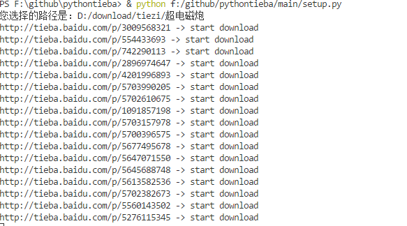
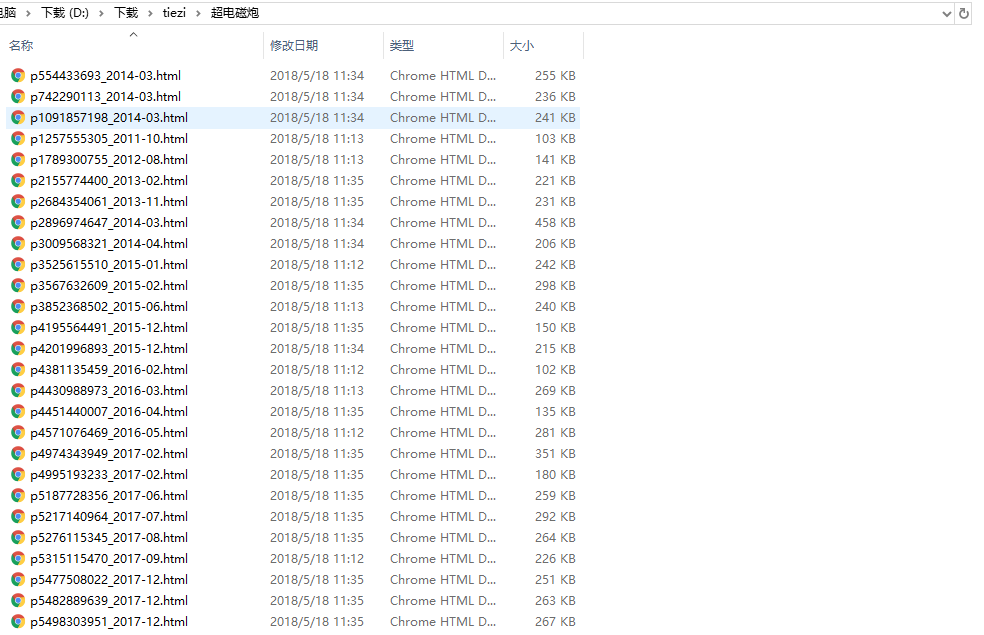

# Python爬虫

这是一个python3 + bs4 + tk 完成的百度贴吧爬虫

## 功能如下

* 爬取指定百度贴吧内容
* 处理爬取内容
* 获取内容中的帖子链接
* 爬取帖子内容并保存到指定路径

## 运行方式

方法1

1. 下载[点击此处下载](https://gitee.com/fantasykill/PythonSpider/blob/master/main/dist/pytieba-spider.zip) 解压运行setup.exe

方法2

1. 安装python3 bs4

2. 运行main/setup.py

3. 输入贴吧名

4. 点击开始按钮，选择存储路径，开始爬取内容

